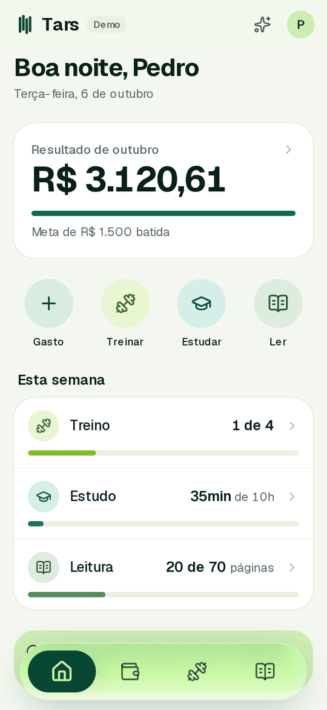
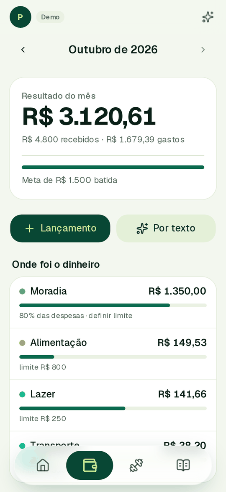
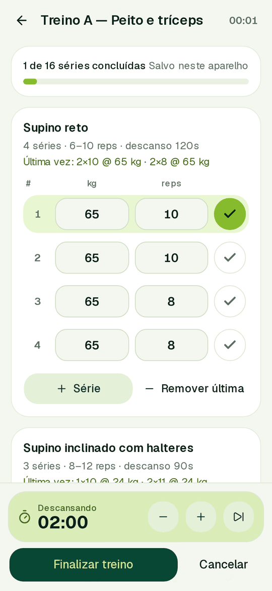
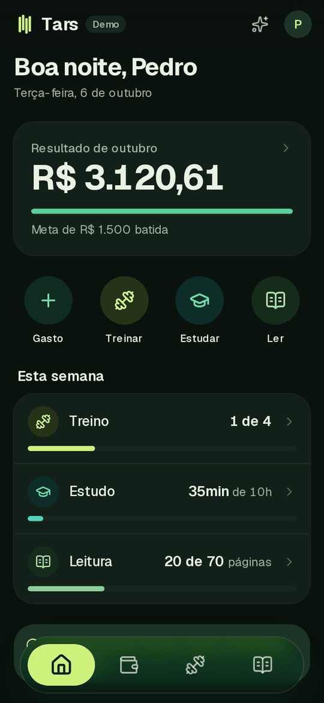
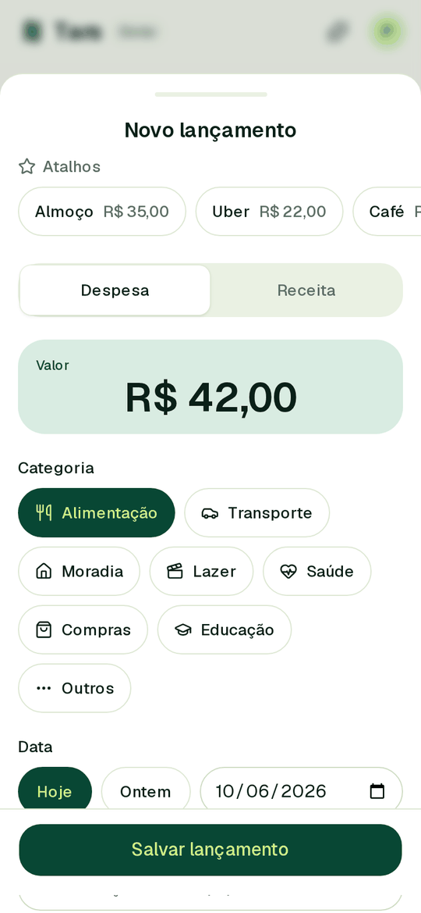
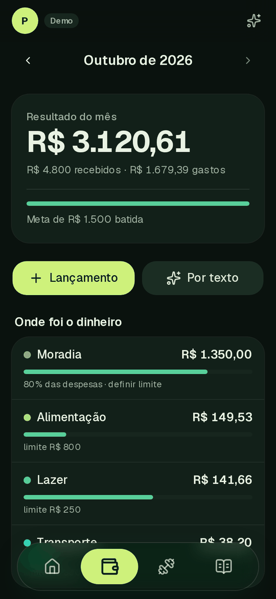
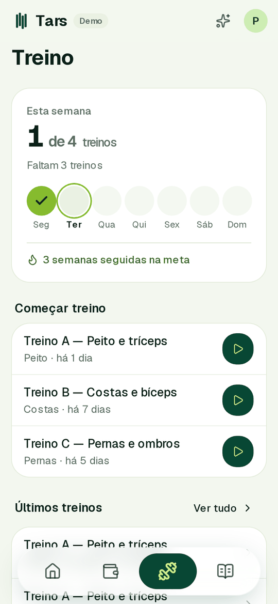
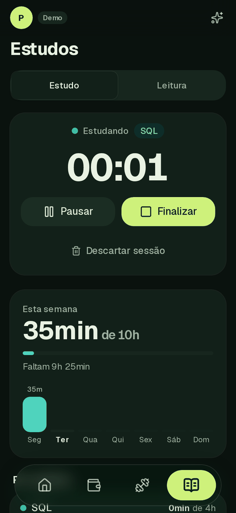
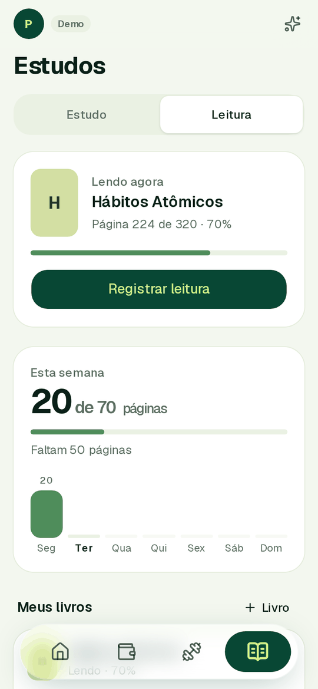
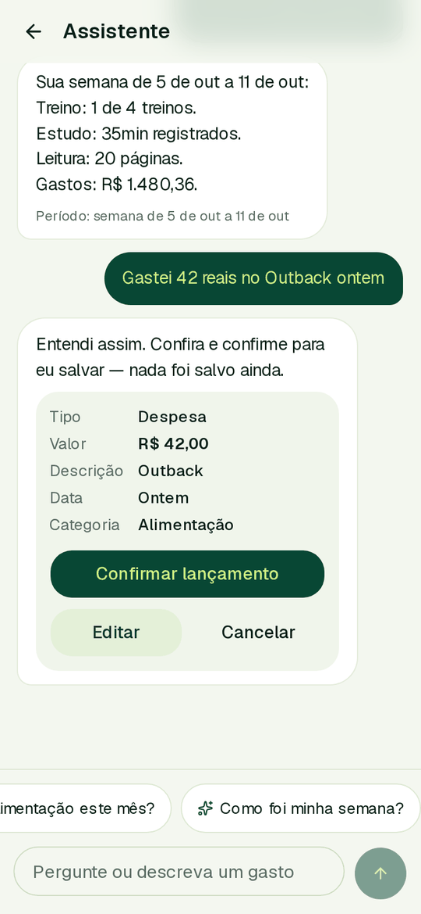

<div align="center">


# Tars

**A personal goal-tracking app for money, training, studying and reading — built mobile-first.**

One screen that answers a single question: *am I on pace this week?*

[](https://nextjs.org)
[](https://react.dev)
[](https://www.typescriptlang.org)
[](https://tailwindcss.com)
[](#how-i-verified-it)





</div>

> **The interface is in Brazilian Portuguese on purpose** — it is a personal app for daily use in Brazil. Code, comments and documentation are in English.

---

## The brief

I wrote a product spec for an app I actually wanted to use: a single place to track **spending, workouts, study time and reading**, with fast logging and a history I can trust. The full spec lives in [`docs/especificacao-app-pessoal.md`](docs/especificacao-app-pessoal.md).

The spec is deliberately opinionated about the hard parts, and those constraints are what make the project interesting:

- Money must be exact. Dates must survive timezones. A week starts on Monday.
- Changing a goal today must **not** rewrite what last month's goal was.
- Editing a workout plan must **not** rewrite workouts already performed.
- A timer must survive a reload, a locked screen and an app switch.
- The AI may *propose*, but may never *save* without explicit confirmation.

Most of the engineering effort went into honoring those rules, not into drawing screens.

## The first decision: prove the experience before building a backend

The spec asks for Supabase, auth and AI. I deliberately **did not start there**.

The riskiest part of a personal productivity app is not persistence — it is whether the owner actually opens it every day. So phase zero ships the **entire interface running on realistic mock data**, with every business rule already implemented and unit-tested, so the experience can be judged on a real phone before a single table exists.

That choice shaped the architecture: all business logic lives in pure, dependency-free functions, and the screens read through a single data layer. Swapping mock storage for a real database means rewriting **one folder**, not the app.

```
Screens
  ├─▶ src/data     reads and writes      → mock store today
  │                                        Supabase next — only this layer swaps
  └─▶ src/domain   every calculation     → pure functions, no React, no I/O
```

---

## The screens

### Home — pace at a glance

The home screen answers "am I on track?" in one scroll. A single hero number for the month, four one-tap actions, and one row per weekly goal with a progress bar. Alerts are capped at two so the screen never turns into a wall of warnings.

Progress is always phrased with numerator, denominator and period — `1 de 4` (1 of 4) this week — never a bare percentage.

<div align="center">


</div>

### Money — where it went, and whether I am within budget

The month's **result** (income minus expenses) leads, followed by spending per category against its budget. Filters are hidden behind a button: the common case is reading the list, not filtering it.

Logging an expense opens a numeric keypad first, with recent categories and saved shortcuts — the daily action takes two or three taps.

<div align="center">



</div>

### Training — a session you can run at the gym

Starting a workout pre-fills every set with **what you lifted last time**, so confirming a set is one tap. The live session is kept on the device and only written on finish: gyms have bad signal, and an abandoned session should never pollute the history or count toward the weekly goal.

<div align="center">


</div>

### Studying and reading

The study timer is driven by timestamps, not by a running counter, so it survives a reload, a background switch and a locked screen. Reading is logged as "I was on page X, now I'm on page Y" — the app derives pages read, so edits and deletions always recompute cleanly.

<div align="center">


</div>

### Assistant — proposes, never saves

Natural-language logging ("I spent 42 reais at Outback yesterday") produces an **editable proposal**. Nothing is written until the user confirms, and confirming twice cannot create two entries. Summary answers are computed from the same domain functions that render the screens, so the assistant can never disagree with the UI.

In this phase the parsing runs locally, which keeps the interaction honest to review before paying for an API.

<div align="center">

</div>

---

## The rules that actually drive the product

This is the part of the spec I care most about, and where the tests are concentrated.

| Rule | Why it matters | Where it lives |
| --- | --- | --- |
| Money is **integer cents**, never floats | `R$ 3.500 − R$ 42` must be exactly `R$ 3.458,00`, forever | [`domain/money.ts`](src/domain/money.ts) |
| It is called **"result of the month"**, not "balance" | It is the sum of what was logged, not a bank balance — the wording avoids a false promise | [`domain/finance.ts`](src/domain/finance.ts) |
| Business dates are `YYYY-MM-DD`; instants are epoch ms | A purchase at 23:30 in São Paulo belongs to *that* day, not to the UTC one | [`lib/dates.ts`](src/lib/dates.ts) |
| Goals carry a **validity date** | Raising this week's target must not retroactively change whether March was met | [`domain/goals.ts`](src/domain/goals.ts) |
| Sessions snapshot the plan | Renaming or reordering a workout plan must not rewrite sessions already performed | [`domain/workouts.ts`](src/domain/workouts.ts) |
| The timer stores timestamps + accumulated time | A counter stops when the phone sleeps; a timestamp does not | [`domain/studies.ts`](src/domain/studies.ts) |
| Pages read = `end − start` | The page you were on when you registered the book is not "read this week" | [`domain/reading.ts`](src/domain/reading.ts) |
| Only **finished** sessions count toward goals | A workout in progress is not an achievement | [`domain/summary.ts`](src/domain/summary.ts) |
| Progress bars clamp to 0–100%, the real number stays in text | A 208% month should read as 208%, while the bar stays sane | [`domain/progress.ts`](src/domain/progress.ts) |
| The weekly streak is forgiving | The current, unfinished week never breaks a streak — motivation shouldn't punish Tuesday | [`domain/streaks.ts`](src/domain/streaks.ts) |
| Home computes its summary locally | Opening the app must never cost an AI call | [`domain/attention.ts`](src/domain/attention.ts) |

A few decisions diverge from my original spec. Each one is written down with its reasoning in [`docs/decisoes.md`](docs/decisoes.md) — including goals-by-validity (which replaced four separate goal tables) and keeping the live workout on-device.

---

## Architecture

```
src/
  domain/      Pure business rules. No React, no I/O, fully unit-tested.
               money · dates/periods · goals · summaries · streaks · parsing
  data/        The only way screens reach data. Swapping the mock store for
               Supabase happens here and nowhere else.
  components/  Screens per module (finance, workouts, studies, reading, home)
               plus shared primitives (progress, sheets, empty states).
  app/         Routes: (tabs) with the floating nav, (sub) for full-screen flows.
  lib/         Constants, timezone-safe dates, formatting.
```

Three rules keep it honest:

1. **Screens never compute business values inline.** Totals, goals and periods all come from `src/domain`, which is why the home screen and each module can never show different numbers for the same period.
2. **Screens never import the mock store.** They depend on `@/data` only.
3. **Design tokens live in one file.** The entire palette — Emerald Pine `#084734`, Lime Glow `#CEF17B`, Green Tea `#CDEDB3` — is defined at the top of [`globals.css`](src/app/globals.css), in light and dark variants.

The logo is four identical vertical blades, offset from one another: the segmented monolith of the robot the app is named after, caught mid-stride. The heights are deliberately equal — blades of *different* heights read as a bar chart, which is exactly what a goal-tracking app should avoid looking like. It inherits `currentColor`, so one shape serves the header, the app icon and both themes ([`logo.tsx`](src/components/brand/logo.tsx), [`docs/brand/`](docs/brand)).

### Interface details worth calling out

- Floating glass navigation bar with a **single pill that slides** to the tapped icon. The target is set on tap rather than after navigation resolves, because waiting left the pill frozen for ~160 ms and the motion felt broken. It respects `prefers-reduced-motion`.
- Touch targets are at least 44 px; the shadcn/ui defaults were adjusted upward for that.
- Safe-area insets, no horizontal scroll at 375 px, and installable to the iOS home screen via a web manifest.
- If the JavaScript never boots, an inline script explains why instead of leaving a skeleton spinning forever.
- A 2.65-second branded launch animates the four logo blades, then fades into the loaded app. It runs on each full load and each return to the installed app, without replaying on internal navigation or resetting forms/timers. Reduced motion uses a brief static reveal. Thirteen portrait iPhone startup images match the logo and background before JavaScript starts; the native handoff still needs verification on a physical iPhone.

---

## How I verified it

| Layer | What it covers |
| --- | --- |
| **63 unit tests** (Vitest) | Money arithmetic, timezone boundaries at midnight, Monday-based weeks, goal validity, timer pause/resume, page counting, streaks |
| **27 end-to-end flows** ([`e2e/flows.mjs`](e2e/flows.mjs), Playwright) | Logging and deleting an expense and watching totals recompute, a full workout including a reload mid-session, the timer surviving a refresh, reading 30 → 50 counting as 20 pages, and double-tap protection on every confirm |
| **Build & static checks** | `tsc --noEmit`, ESLint, and a production build with Cache Components enabled |

The end-to-end suite runs against the app served over the local network — the same way it is opened on a phone — and verifies there are no console errors and no horizontal overflow at 375 px.

```bash
npm test          # unit tests
npm run test:e2e  # end-to-end flows (needs `npm run dev` running)
npm run test:splash # launch, installed resume, accessibility and recovery flows
npm run lint      # ESLint
npm run build     # production build
```

---

## Running it

Requires Node 20+ (developed on 22).

```bash
npm install
npm run dev       # http://localhost:3000, and your machine's IP on the same network
```

**To try it on a phone:** open `http://<your-ip>:3000` in Safari, then *Share → Add to Home Screen*. The dev config detects local network addresses automatically, so the app is reachable from the phone without extra setup.

The app seeds itself with realistic demo data generated relative to today. It is clearly labeled **Demo** in the header and can be reset from Settings.

---

## Status and what comes next

**Phase 0 (current):** complete interface, every business rule implemented and tested, mock persistence in the browser. The point is to validate the experience on a real phone before building a backend.

| Next | Scope |
| --- | --- |
| Foundation | Supabase auth, schema with row-level security, swap `src/data` |
| Modules | Move each module from mock to live data |
| AI | Verify provider pricing and limits first; confirmation stays mandatory |
| Release | Offline shell, deploy to Vercel, validate on a real iPhone |

**Known limitations, stated plainly:** there is no authentication, database or real AI yet; plans and categories are not editable in this phase; and the interface has not yet been validated on physical iPhone hardware.

---

## Tech

**Next.js 16** (App Router, Cache Components, Partial Prefetching) · **React 19** · **TypeScript** · **Tailwind CSS 4** · **shadcn/ui** on Radix · **Zustand** · **date-fns** · **Vitest** · **Playwright**

No charting library: the rings, bars and sparklines are hand-written SVG and CSS, which keeps the bundle small and the visuals consistent with the palette.
